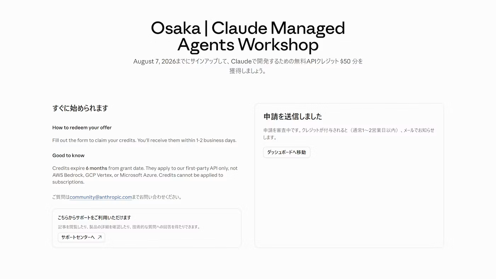

import { Aside, Steps } from '@astrojs/starlight/components';

Build Dayの参加者には、**Claude Codeで使えるAPIクレジット**を配布予定です。当日会場で申請用のURLをご案内しますので、この手順で申請してください。

<Aside type="caution" title="クレジットが配布できない場合">
	何らかの事情で配布できない場合は、各自でクレジットの購入をお願いします。手順はこのページの[自分でクレジットを購入する場合](#自分でクレジットを購入する場合)にあります。
</Aside>

## クレジットを申請する

<Steps>

1. [Claude Platform](https://platform.claude.com)にログイン済みであることを確認します。

1. イベント当日に提示されるURLにアクセスします。

    <Aside type="tip" title="申請URLは当日ご案内します">
    	会場のスライドで表示します。
    </Aside>

1. メールアドレス、組織名があっていることを確認し、氏名（First name / Last name）を入力します。「Which Anthropic products do you currently use?」で「Claude API」にチェックを入れ、「申請を送信」をクリックします。

    

1. 完了画面が表示されます。申請が審査され、クレジットが付与されるとメールでお知らせが届きます。

    

</Steps>

<Aside type="note" title="付与までに少し時間がかかります">
	申請してすぐに反映されるわけではありません。当日は早めに申請を済ませておくとスムーズです。
</Aside>

## 受け取れたか確認する

Claude Platformの左下（または「請求」メニュー）に残高が表示されます。Claude Code側では、起動中に `/usage` を実行するとそのセッションで使った量の目安が確認できます。

クレジットを使い切ると、Claude Codeで `Credit balance is too low` のようなエラーが出ます。その場合は下の手順で購入するか、スタッフに声をかけてください。

## 自分でクレジットを購入する場合

配布分を使い切った場合や、事前に試しておきたい場合はこちら。

<Steps>

1. 画面左下の「資金を追加」をクリックします。

    

1. クレジットカードを登録し、クレジットを購入します。

</Steps>

<Aside type="tip" title="使いすぎが心配な方へ">
	支出の上限をあらかじめ設定できます。[利用上限とコストの確認](/reference/costs/)を参照してください。
</Aside>
