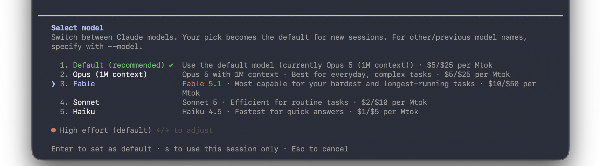

import { Aside, Steps, Tabs, TabItem, LinkButton } from '@astrojs/starlight/components';

Create a working folder, set your API key, and get as far as actually starting it up. Once this is done, all that is left on the day is building.

## Create a working folder

Claude Code uses "the folder you currently have open" as its workspace. Create a dedicated folder so things stay tidy.

<Tabs syncKey="os">

<TabItem label="macOS">

```sh
mkdir -p ~/build-day
cd ~/build-day
```

</TabItem>

<TabItem label="Windows">

```powershell
mkdir -Force $HOME\build-day
cd $HOME\build-day
```

<Aside type="note" title="Why `-Force` is there">
	PowerShell's `mkdir` errors out if the folder already exists. With `-Force` you can run it again later without an error.
</Aside>

</TabItem>

</Tabs>

## Set your API key

If you put a settings file inside the working folder, **your key stays even after you reopen the terminal**. You do not have to enter it every time.

<Steps>

1. Create the settings file and open it. Run this while you are in the working folder (`build-day`).

    <Tabs syncKey="os">

    <TabItem label="macOS">

    ```sh
    mkdir -p .claude
    touch .claude/settings.json
    open -e .claude/settings.json
    ```

    An empty file opens in TextEdit.

    </TabItem>

    <TabItem label="Windows">

    ```powershell
    New-Item -ItemType Directory -Force .claude | Out-Null
    if (!(Test-Path .claude\settings.json)) { "" | Set-Content .claude\settings.json }
    notepad .claude\settings.json
    ```

    An empty file opens in Notepad.

    </TabItem>

    </Tabs>

1. Paste in the following, replace `YOUR_API_KEY_HERE` with [the key you created](../apikey/) (the string starting with `sk-ant-`), and save.

    ```json
    {
      "env": {
        "ANTHROPIC_API_KEY": "YOUR_API_KEY_HERE"
      }
    }
    ```

    <Aside type="caution" title="Copy and paste this — do not type it by hand">
    	TextEdit has smart quotes on by default. If you type `"` by hand it is replaced with a curly quote, which breaks the JSON and gives you a confusing error when Claude Code starts.
    </Aside>

</Steps>

<Aside type="caution" title="Do not hand this file to anyone">
	`settings.json` contains your API key in plain text. **If you publish the working folder to GitHub or elsewhere, you publish the key along with it.** When you share what you built, share only the HTML file.
</Aside>

## Start it

<Steps>

1. Type `claude` and press Enter.

    ```sh
    claude
    ```

1. You are asked whether to use the API key. **Press `↑` to select `Yes`, then press Enter.**

    ```
    Detected a custom API key in your environment

    ANTHROPIC_API_KEY: sk-ant-...FwAA

    Do you want to use this API key?

        Yes
      ❯ No (recommended)

    Enter to confirm · Esc to cancel
    ```

    **`No (recommended)` is selected by default.** Pressing Enter without thinking picks "No", and the API key you just set is not used. Your answer is remembered, so you are only asked once.

1. You are ready once the Claude Code prompt appears. The version, the model in use and the working directory are shown at the top. **If your API key is set, you will not be asked to log in** (only the API key confirmation above is shown, the first time).

</Steps>

## Switch the model to Fable 5.1

Right after startup, the default model (e.g. `Opus 5`) is selected. Build Day is about the newly released **Fable 5.1**, so switch to it with `/model`.

<Steps>

1. Type `/model` and press Enter.

1. Choose `Fable` (Fable 5.1) from the list and press Enter. Enter sets it as your default model; `s` applies it to this session only.

    

1. The switch is done once the display at the top shows `Fable 5.1`.

</Steps>

## Check which authentication is in use

An API key takes **priority** over login credentials. While it is running, open `/usage` or `/login` to see which account and which authentication it is currently using.

<Aside type="caution" title="A note for Pro/Max subscribers">
	If you set an API key on a machine that is already logged in with a Pro/Max plan, **the key wins and API credits are consumed**. Conversely, if you want to use API credits but forget to set the key, it runs within your subscription. Decide which one you want before starting it.

	To run within your subscription, start `claude` without creating `.claude/settings.json` and log in. If you already created it, delete that file to go back to login-based authentication.
</Aside>

<Aside type="note" title="If you see `Both claude.ai and ANTHROPIC_API_KEY set`">
	If you set an API key on a machine already logged in to claude.ai, this warning appears at startup.

	```
	▲ Both claude.ai and ANTHROPIC_API_KEY set · auth may not work as expected
	▲ claude.ai connectors are disabled because ANTHROPIC_API_KEY ...
	```

	**This is the expected state: the API key wins and everything works normally.** If the display at the top shows `API Usage Billing`, you are running on API credits.
</Aside>

## Build your first thing

Write it at the prompt in plain language and press Enter.

```text
Create an HTML file in this folder that just shows today's date
```

Claude creates the file, shows you the changes, and asks permission to run it. Approve it and the work continues. **It always asks before changing a file**, so nothing gets broken behind your back.

Once you get the hang of it, try asking for things like this.

```text
Open the HTML you made in a browser and show me
```

```text
Make the background a gradient and add a clock
```

## Commands worth remembering

Once Claude Code is running, you can use commands that start with `/`. You do not need to memorize them all.

| Command | What it does |
| :--- | :--- |
| `/help` | List the available commands |
| `/login` | Log in again or switch accounts |
| `/usage` | A rough figure for usage and cost in the current session |
| `/clear` | Reset the conversation (when moving on to something else) |
| `/model` | Switch the model in use |
| `/exit` | Quit (`Ctrl+D` also works) |

For keyboard shortcuts, `Shift+Tab` switches permission modes and `Escape` interrupts whatever is running. If you feel it is heading in the wrong direction, do not hesitate to press `Escape`.

<Aside type="tip" title="When stuck, ask Claude itself">
	The fastest way to learn how to use Claude Code is to ask Claude Code. Just ask in plain language, like `Tell me what you can do` or `What did that error mean?`.
</Aside>

## Next step

That is the whole setup. To give you ideas for what to build on the day, we have prepared real prompts and the things they produced.

<LinkButton href="../../showcase/" icon="right-arrow">
	Showcase: prompts and results
</LinkButton>
