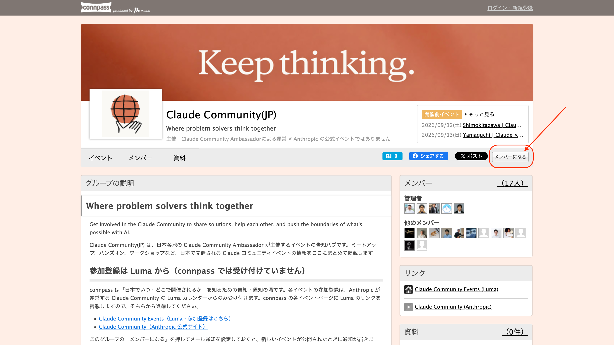

import { Aside, Steps, LinkButton } from '@astrojs/starlight/components';
import { CONNPASS_URL } from '../../../../consts.ts';

**Claude Community(JP)** is the announcement hub for events run by Claude Community Ambassadors across Japan. Meetups, hands-on sessions and workshops held in Japan are all listed there.

Press **「メンバーになる」 (Become a member)** on the group page and turn on email notifications, and **you will be notified whenever a new event is announced**. It is the easiest way not to miss the next one.

{CONNPASS_URL ? (
	<LinkButton href={CONNPASS_URL} target="_blank" rel="noopener noreferrer" icon="external">
		Open Claude Community(JP) on connpass
	</LinkButton>
) : (
	<Aside type="tip" title="We will share the group URL on the day">
		It will be shown on the slides at the venue.
	</Aside>
)}

## How to join

<Steps>

1. Open the group page from the link above.

1. Click **「メンバーになる」 (Become a member)** at the top right. A connpass account is required.

    

1. Check your email notification settings. You will now be told whenever a new event is announced.

</Steps>

<Aside type="note" title="Registration happens on Luma, not connpass">
	connpass is the place to find out **when and where** events are happening in Japan. Registration for each event is only accepted through the Claude Community Luma calendar run by Anthropic. Every connpass event page links to Luma, so please sign up from there.
</Aside>

<Aside type="caution" title="This is not an official Anthropic event">
	Claude Community(JP) is run by Claude Community Ambassadors. It is not an official Anthropic event.
</Aside>
