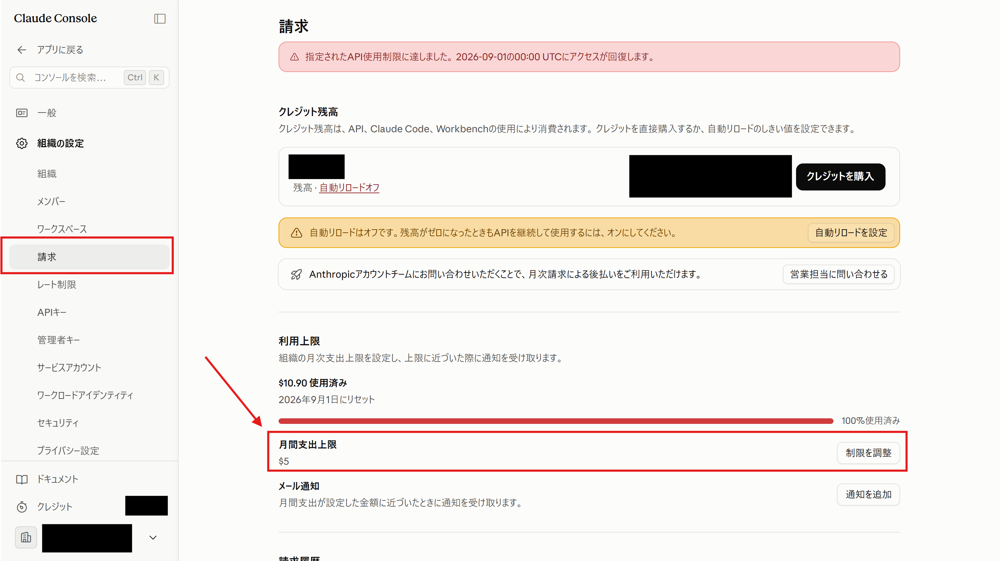

import { Aside, Steps } from '@astrojs/starlight/components';

<Aside type="note" title="Using Claude Code is API usage too">
	When you use Claude Code with an API key, you're billed per token just like any other API usage, and it's deducted from your credits. That means **a spending limit you set in the console applies to Claude Code usage as well**.
</Aside>

## Set an organization-wide monthly spending limit

We recommend setting a limit to avoid unexpected charges.

<Steps>

1. Click the 「請求」 (Billing) menu under 「組織の設定」 (Organization settings).

1. Click 「制限を調整」 (Adjust limit) under 「月額支出上限」 (Monthly spending limit) and set the limit.

    

</Steps>

The limit applies to the whole organization, so **it applies to Claude Code usage via an API key as well**. For Build Day, this setting alone is enough.

<Aside type="note" title="About per-workspace limits">
	The console also lets you set limits per workspace, but **you can't set one on the `Default` workspace**. The keys you issue for Build Day are created in `Default`, so manage them with the organization-wide limit above.

	If you want separate limits per use case, create a workspace other than `Default` and issue a dedicated API key there.
</Aside>

## Check what you've spent

| Where to check | What it tells you |
| :--- | :--- |
| `/usage` inside Claude Code | Rough token usage and cost for the current session |
| [Usage page in the console](https://platform.claude.com/usage) | Official usage records and balance |
| [Claude Code dashboard](https://platform.claude.com/claude-code) | Claude Code usage per member |

The amount shown by `/usage` is an **estimate** calculated locally. Check the console for exact billing.

## What it actually costs

The [Showcase](/en/showcase/) lists measured figures for six pieces actually built with Fable 5.1. Each was a single prompt with no follow-up instructions, costing **$9–$24 per piece** and taking 9 to 34 minutes.

Output tokens accounted for **67%** of the cost, while input (the prompt itself) was just **0.1%**. The credits we hand out are **$100** per person.

## Tips for keeping costs down

You don't need to worry much for a few hours at Build Day, but these are worth knowing for everyday use.

- **Run `/clear` when you move to different work**: the longer a conversation gets, the more tokens each exchange consumes. Resetting when you switch to unrelated work is the single biggest saving.
- **Pick the right model**: switch with `/model`. A lighter model handles everything except involved design decisions just fine.
- **Be specific in what you ask for**: "add input validation when the form in `index.html` is submitted" beats "make this code better" — fewer unnecessary file reads, so it's faster and cheaper.
- **Press `Escape` when it heads the wrong way**: stopping early and re-instructing is cheaper than letting it run and rebuilding afterwards.
