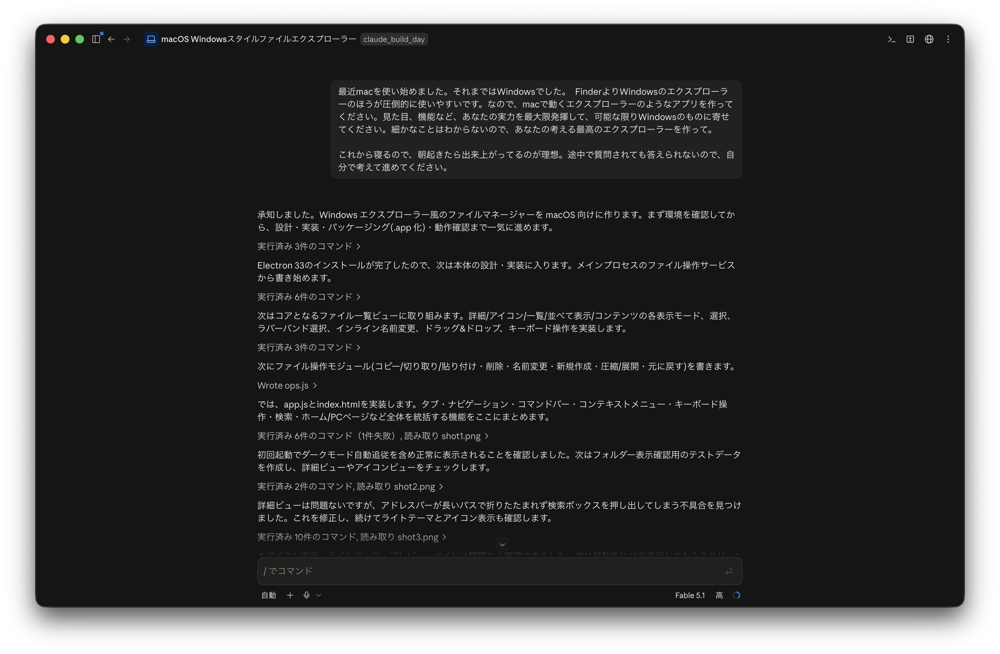
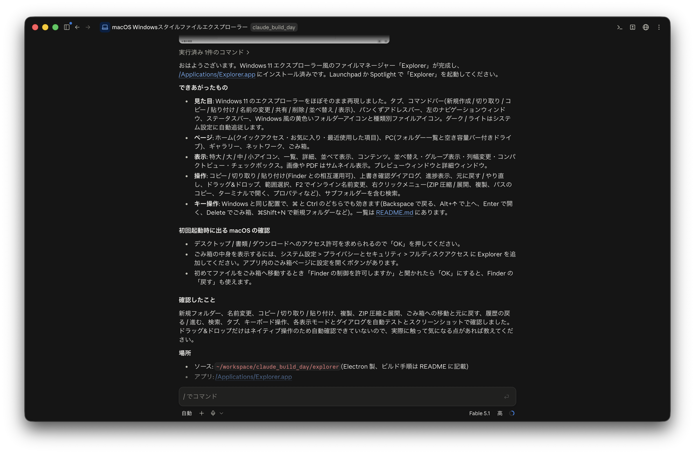

import { Aside, Badge, Tabs, TabItem } from '@astrojs/starlight/components';
import XPost from '../../../../components/XPost.astro';

All six examples above are single HTML files, but that is not the limit of what Fable 5.1 can build. Here are two macOS apps the organiser ([moritalous](https://github.com/moritalous)) actually had it build. Both are native apps written in Swift.

## Reproducing Alt+Tab (Windows-style window switching on macOS)

<p class="badges"><Badge text="Original" variant="tip" /><Badge text="$27.61" variant="success" /></p>

Here is the organiser's post about an app that reproduces the Windows `Alt+Tab` switcher on macOS.

<XPost url="https://x.com/moritalous/status/2097302855422234705" />

The source is at [moritalous/alt-tab-mac](https://github.com/moritalous/alt-tab-mac). The prompt used for it was not kept.

### Measured usage (tokens)

How long it took was not recorded. The model was `claude-fable-5-1`.

| Item | Tokens | Unit price | Cost |
| :--- | ---: | ---: | ---: |
| Base input | 2,876 | $10/MTok | $0.03 |
| 1h cache write | 771,636 | $20/MTok | $15.43 |
| Cache read | 13,114,988 | $0.25/MTok | $3.28 |
| Output | 177,441 | $50/MTok | $8.87 |
| **Subtotal** | **14,066,941** | — | **$27.61** |

<Aside type="note">
	Each line is rounded, so the total may not match the sum exactly. The cost is an estimate calculated from the session log.
</Aside>

## Windows-style file explorer

<p class="badges"><Badge text="Original" variant="tip" /><Badge text="$54.02" variant="success" /><Badge text="52 min" variant="tip" /></p>

Here is the organiser's post about having it build a Windows-style file explorer for macOS.

<XPost url="https://x.com/moritalous/status/2098930080680739180?s=20" />

## The prompt

<Tabs syncKey="prompt-lang">

<TabItem label="Original (Japanese)">

```text wrap
最近macを使い始めました。それまではWindowsでした。　FinderよりWindowsのエクスプローラーのほうが圧倒的に使いやすいです。なので、macで動くエクスプローラーのようなアプリを作ってください。見た目、機能など、あなたの実力を最大限発揮して、可能な限りWindowsのものに寄せてください。細かなことはわからないので、あなたの考える最高のエクスプローラーを作って。

これから寝るので、朝起きたら出来上がってるのが理想。途中で質問されても答えられないので、自分で考えて進めてください。
```

</TabItem>

<TabItem label="English translation">

```text wrap
I recently started using a Mac. Before that I used Windows, and Windows Explorer is far easier to use than Finder. So please build an app that works like Explorer, but for macOS. Put your full ability into the look and the features, and get it as close to the Windows one as you can. I don't know the fine details, so just build the best explorer you can imagine.

I'm about to go to sleep, so ideally it will be done by the time I wake up. I won't be able to answer if you ask me anything along the way, so please just use your own judgment and keep going.
```

</TabItem>

</Tabs>

Start of the session:



End of the session:



### Measured usage

Duration **52 min** / Model `claude-fable-5-1` / Assistant turns **166**

| Type | Tokens | Unit price | Cost |
| :--- | ---: | ---: | ---: |
| Input | 4,502 | $10.00/M | $0.05 |
| Output | 605,692 | $50.00/M | $30.28 |
| Cache write | 1,037,581 | $12.50/M | $12.97 |
| Cache read | 42,891,484 | $0.25/M | $10.72 |
| **Total** | **44,539,259** | — | **$54.02** |

<Aside type="note">
	Each line is rounded, so the total may not match the sum exactly. The cost is an estimate calculated from the session log.
</Aside>
