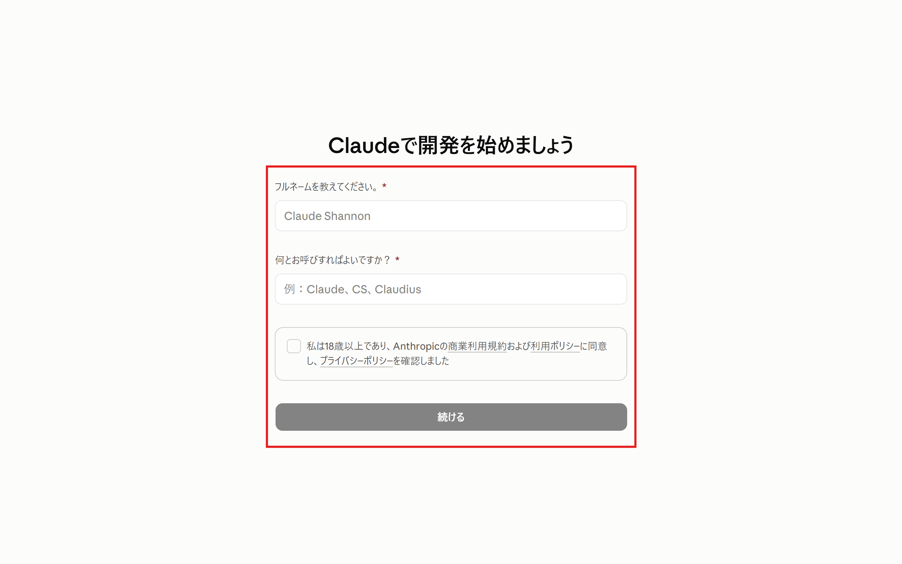
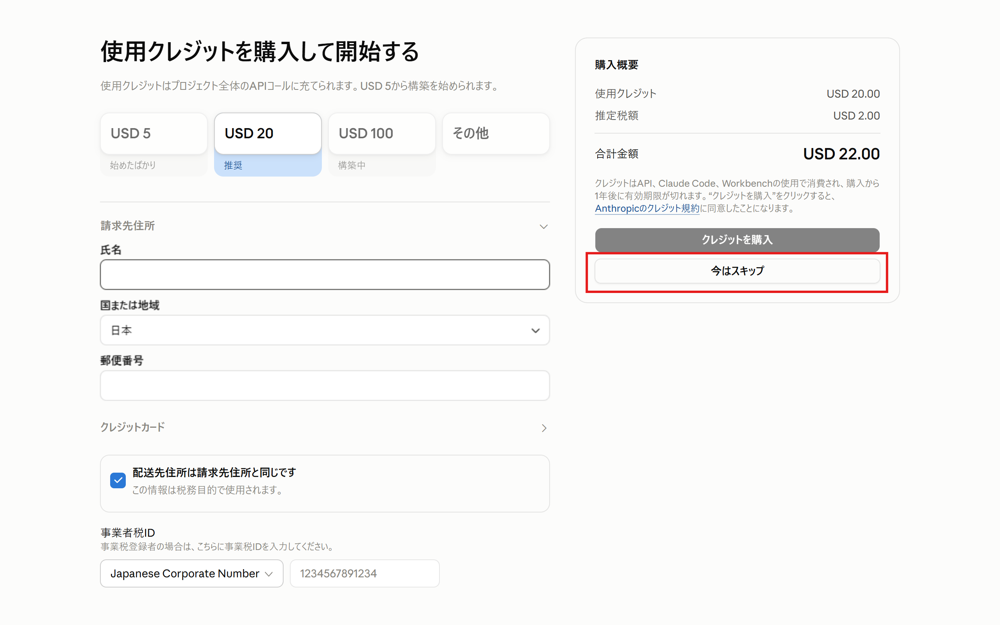

import { Aside, Steps, LinkButton } from '@astrojs/starlight/components';

Build DayではClaude Codeを**APIクレジット**で動かします。そのために[Claude Platform](https://platform.claude.com)（開発者向けのコンソール）のアカウントが必要です。**イベント前に作成をお願いします**。所要時間は3分程度です。

<Aside type="caution" title="claude.aiのアカウントとは別物です">
	チャットサービスの[claude.ai](https://claude.ai)のサブスクリプションアカウント（Pro/Maxプラン含む）とは**別のアカウント**です。開発者向けの**Claude Platform**のアカウントを作成してください。

	すでにClaude Pro/Maxを契約している方も、クレジットを受け取るにはClaude Platformのアカウントが必要です（Claude CodeはPro/Maxのままでも使えます。詳しくは[初回起動](/preparation/first-run/)を参照）。
</Aside>

## アカウントを作成する

<Steps>

1. [platform.claude.com](https://platform.claude.com)にアクセスし、アカウントを作成します。Googleアカウントまたはメールアドレスで登録できます。

    

1. 名前などを入力します。

    

1. 支払い情報の入力を求められますが、「今はスキップ」を選択します。クレジットはイベント当日に配布します。

    

1. アカウントが作成されました。

    

1. 表示言語はこちらから変更できます。日本語表示にしておくと当日の説明を追いやすいです。

    

</Steps>

<Aside type="tip" title="クレジットの購入は不要です">
	参加者にはAPIクレジットを配布予定です。事前の購入は必要ありません。受け取り方は[APIクレジットの受け取り方](/credits/)を参照してください。
</Aside>

## 次のステップ

<LinkButton href="../../credits/" icon="right-arrow">
	次へ：APIクレジットの受け取り方
</LinkButton>
