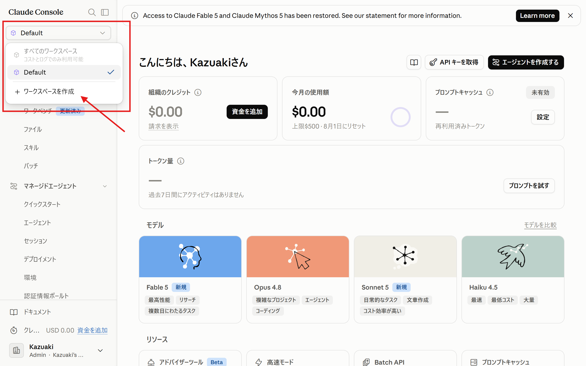
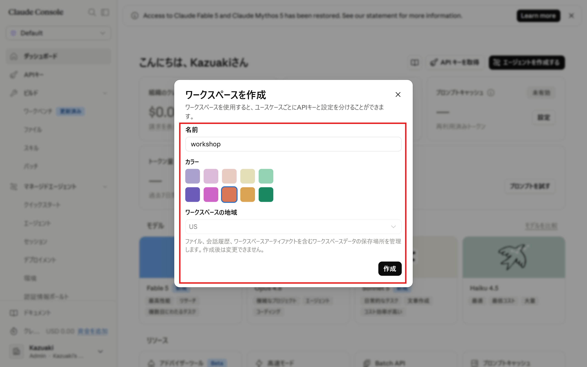
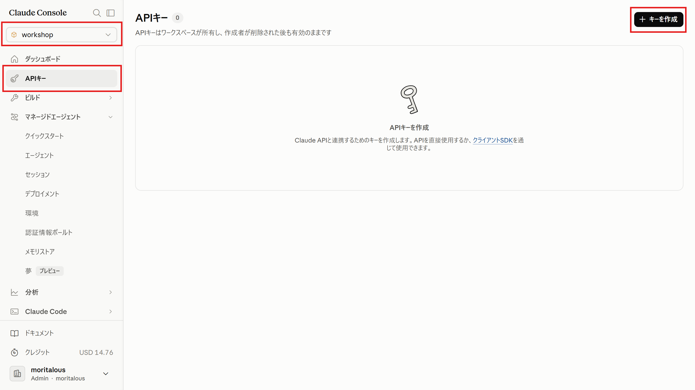
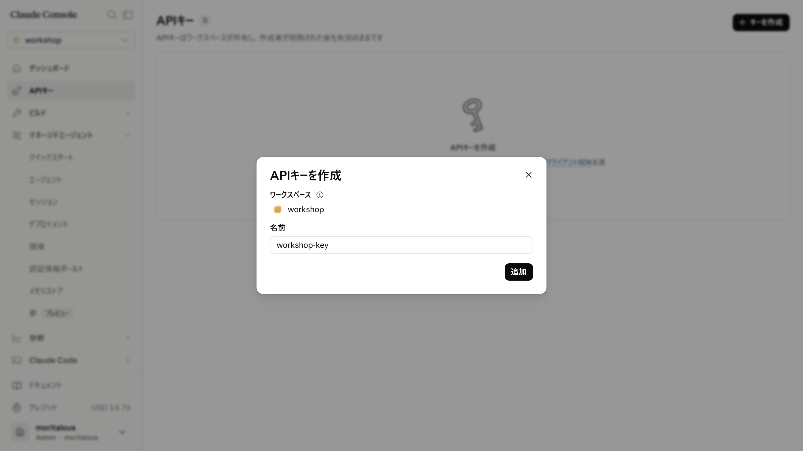

import { Aside, Steps, LinkButton } from '@astrojs/starlight/components';

Build Dayでは、**ご自身のClaude Platformアカウントで発行したAPIキー**でClaude Codeを動かします。受け取ったAPIクレジットは、このキー経由で消費されます。

<Aside type="tip" title="Pro/Maxプランをお使いの方">
	claude.aiのPro/Max/Team/Enterpriseプランを契約している方は、APIキーを使わず、そのプランのままでも参加できます。その場合はサブスクリプションの枠で動くので、APIクレジットは消費されません。起動方法は[初回起動](../first-run/)にあります。
</Aside>

## ワークスペースを作成する

APIキーは「ワークスペース」という単位ごとに発行します。アカウント作成直後は`Default`ワークスペースしかありませんが、`Default`では組織の設定を変更しない限りAPIキーを作成できないため、Build Day用に新しくワークスペースを作成します。

<Steps>

1. 画面左上のワークスペース選択部分をクリックし、「ワークスペースを作成」をクリックします。

    

1. 名前を入力し（例：`build-day`。お好きな名前で構いません）、「作成」をクリックします。カラーとワークスペースの地域は初期設定のままで問題ありません。

    

</Steps>

<Aside type="tip" title="切り替わらないときは">
	作成後、画面左上の表示が新しいワークスペース名になっていることを確認してください。`Default`のままの場合は、もう一度ワークスペース選択部分をクリックして切り替えます。
</Aside>

## APIキーを発行する

<Steps>

1. コンソールの「APIキー」メニューを選択し、「キーを作成」をクリックします。画面左上のワークスペースが、ひとつ前の手順で作成したものになっていることを確認してください。

    

1. 名前を入力し、「追加」をクリックします。表示されたAPIキー（`sk-ant-`で始まる文字列）を控えます。**作成時にしか表示されません。**

    

</Steps>

<Aside type="caution" title="作成したワークスペースを選んでください">
	APIキーはワークスペース単位で発行され、そのワークスペースの残高・上限が適用されます。前の手順で作成したワークスペースが選ばれた状態で作成してください。
</Aside>

<Aside type="caution" title="キーの取り扱い">
	APIキーはパスワードと同じものです。スクリプトのコードに直接書いたり、GitHubにコミットしたり、人に見せたりしないよう注意してください。控えるときはパスワードマネージャーなど安全な場所に保管してください。
</Aside>

## 次のステップ

キーを発行したら、Claude Codeをインストールします。

<LinkButton href="../install/" icon="right-arrow">
	Claude Codeのインストール
</LinkButton>
